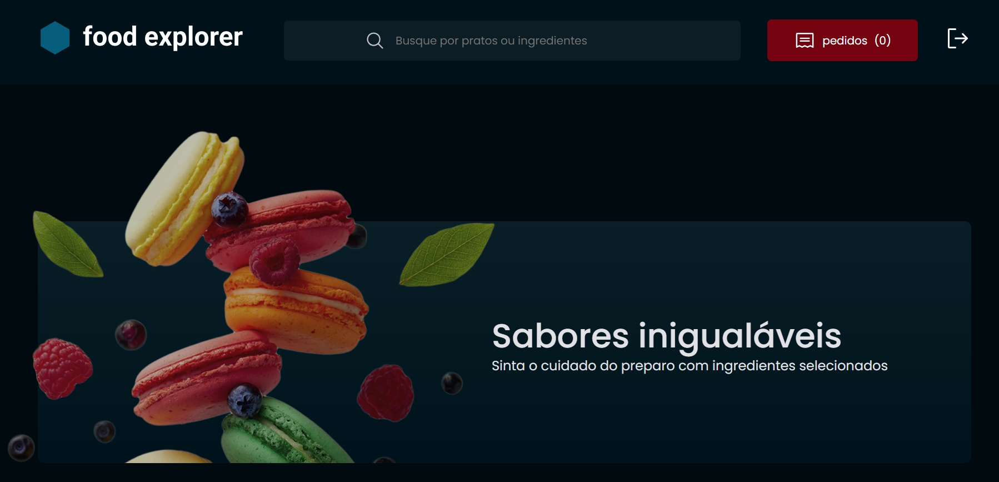

<h1 align="center">
  🖥️ ​ FOOD EXPLORER
</h1>

<h4 align="center"><a href="https://food-front-end-cyan.vercel.app/">Clique para visitar o projeto</a></h4>

## 🌟 Sobre

Desafio Rocketseat, página desenvolvida como parte do curso Explorer. O projeto é uma aplicação de exploração de alimentos, onde você pode visualizar e interagir com diversas opções de pratos e receitas.

---

## 📚 Seções

O site é composto pelas seguintes páginas:

- **Home:** Explore a página inicial para ter uma visão geral do projeto e das principais funcionalidades.
- **Prato:** Visualize detalhes sobre pratos específicos.
- **Novo Prato:** Adicione novos pratos ao sistema.
- **Editar Prato:** Atualize informações de pratos existentes.
- **Login:** Faça login na aplicação.
- **Sign In:** Registre-se na aplicação.
- **Up:** Acesse informações adicionais ou funcionalidades extras.

---

## 🔒 Acesso e Permissões

O projeto possui dois tipos de acesso:

- **Usuário (User):**

  - **Home:** Página inicial com visão geral.
  - **Prato:** Detalhes sobre pratos.

- **Administrador (Admin):**
  - **Home:** Página inicial com visão geral.
  - **Prato:** Detalhes sobre pratos.
  - **Adicionar Prato:** Adicione novos pratos ao sistema.
  - **Editar Prato:** Atualize informações de pratos existentes.
  - **Deletar Prato:** Remova pratos do sistema.

---

## 💼 Tecnologias utilizadas

Para o desenvolvimento deste site utilizei as seguintes tecnologias:

- React;
- Styled Components;
- Node.js;
- SQLite;
- Express;

---

<h2>Desenvolvedor</h2>

<table>
  <tr>
    <td align="center">
      
Carlos Danyel Silva Teixeira

    </td>
  </tr>
</table>
